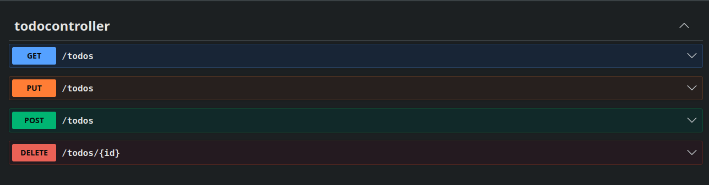

 # 📝 To-Do List API


A RESTful API for task management built with **Java and Spring Boot**.  
Designed to demonstrate clean architecture, best practices, and CRUD operations.

---

## 🚀 Tech Stack
- Java 17+
- Spring Boot
- Spring Data JPA
- Maven
- MySQL
- Swagger (Springdoc OpenAPI)

---

## ⚙️ Database Configuration (MySQL)

```
src/main/resources/application.properties
```

```properties
spring.datasource.url=jdbc:mysql://localhost:3306/YOUR_DB
spring.datasource.username=YOUR_NAME
spring.datasource.password=O+YOUR_PASSWORD

spring.jpa.hibernate.ddl-auto=update

```

---

## ▶️ Running the Application

```bash
git clone https://github.com/cesarfcg/To-do-list.git
cd todo-api
./mvnw spring-boot:run
```

```
http://localhost:8080
```

---

## 📖 API Documentation
The API documentation is available through **Swagger UI**, allowing you to explore and test all endpoints interactively.
```
http://localhost:8080/swagger-ui.html
```

### 📷 Preview


---

## 📌 Endpoints

| Method | Endpoint     |
|--------|-------------|
| GET    | /todos     |
| GET    | /todos/{id} |
| POST   | /todos      |
| PUT    | /todos/{id} |
| DELETE | /todos/{id} |

---

## ⚠️ Common Issues

- Swagger not loading → ensure app is running
- MySQL connection failed → verify credentials
- Port in use → change with `server.port=8081`

---

## 👤 Author

**Fernando César**  
- GitHub: https://github.com/cesarfcg  
- LinkedIn: https://linkedin.com/

---

